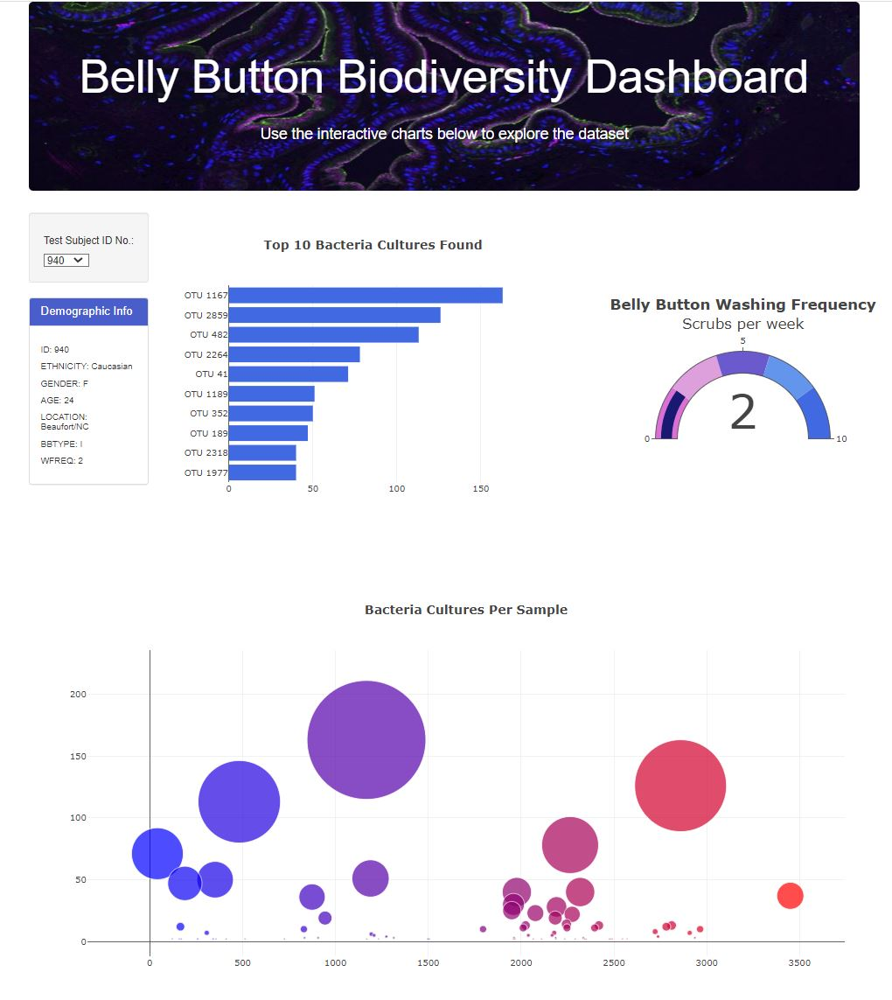

# Belly Button Biodiversity Study Dashboard

## Purpose:
Create a web-based dashboard to visualize individual volunteers' sample data in a biological study.

##  Details:
We designed a webpage where users can see a visual display of sample data collected from each individual volunteer.

Users will be able to select from a list of volunteers from the "Test Subject ID No." drop-down menu.  The web page will then refresh with data from the selected volunteer. This includes individual volunteer demographic information, top-10 bacterial type collected in a bar chart, weekly wash frequency in a gauge chart, and a bubble chart showing all of the bacteria in the collected sample where the size of the bubble corresponds to the amount of the specfic bacteria in the sample.
 

<b>Sample Rendered Web Page</b>

